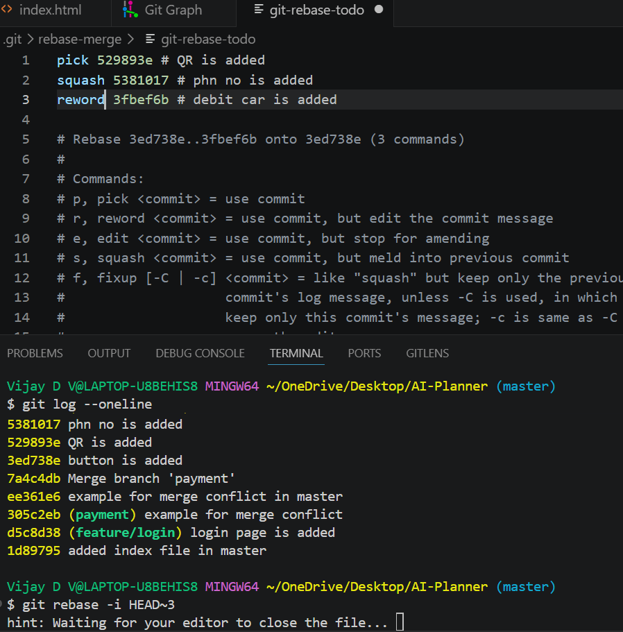
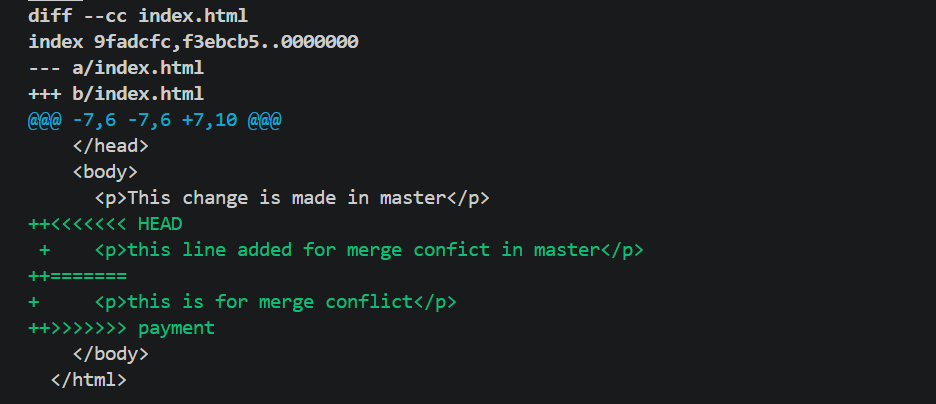
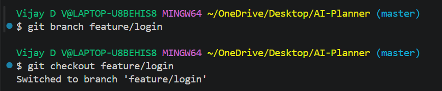
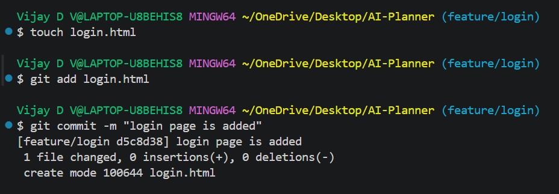

# Undoing Changes and Reverting Commits

## Objective:

Experiment with undoing changes in your working directory and
commits.

## Requirements:

- Modify a tracked file and use `git checkout -- <file>` (or `git restore`) to undo changes.
- Make a commit, then use `git revert` or `git reset` to see how you can undo a commit safely.
- Explain the differences between these approaches.

  

  

  

  

  

## Key Differences

### git restore / git checkout -- <file>

- Used to discard changes in the working directory
- Does not affect commit history

### git revert

- Creates a new commit that undoes the changes of a previous commit
- Safe to use in shared/public repositories

### git reset

- Moves the HEAD pointer to a previous commit
- Can modify or remove commit history
- Types:
  - `--soft`: Keeps changes staged
  - `--mixed`: Keeps changes but unstaged
  - `--hard`: Deletes changes completely
