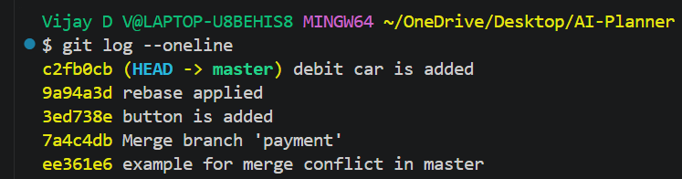

# Git Basics: Initialize, Commit, and Branch

## Objective

- Initialize a new Git repository
- Create files and commit them
- Create a new branch, make changes, and merge it back to the main branch

## Tasks Performed

### 1. Repository Initialization

- Used `git init` to create a new Git repository
- Added files using `git add`
- Saved changes using `git commit`

### 2. Working with Branches

- Created a new branch using:
  - `git branch <branch-name>` OR
  - `git checkout -b <branch-name>`
- Switched between branches

### 3. Merging Changes

- Merged the branch back into the main branch using `git merge`
- Verified commit history using `git log`

## Outcome

Successfully initialized a repository, managed branches, and merged changes while maintaining proper version control.
