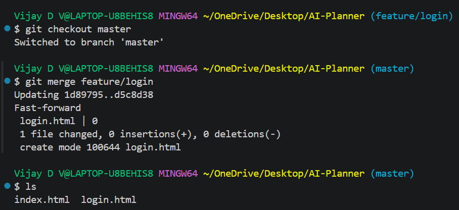

# Working with Remote Repositories and Collaboration

## Objective:

Simulate a collaborative workflow with remote repositories.

## Requirements:

- Create a local repository and push it to a remote service (e.g., GitHub or GitLab).
- Create a feature branch, make commits, and push the branch to the remote.
- Open a Pull Request (or Merge Request) and perform a code review process.
- Merge the feature branch into the main branch on the remote and then pull the changes locally.

### screenshots

